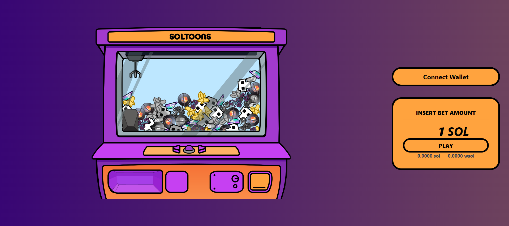

# Soltoons

Soltoons is a Solana claw-machine game originally released in 2023. The original product used Switchboard VRF for verifiable outcomes and supported real on-chain rounds. This repository is now being modernized around a wallet-free playable demo so the game and its history remain accessible without asking visitors to connect a wallet or spend funds.



## Current status

- The wallet-free demo runs locally and does not sign or submit transactions.
- The historical on-chain mode remains in the codebase but has not yet been revalidated against current wallets, Switchboard, RPC providers, or the deployed program.
- Historical activity is shown from a timestamped, checked-in Solana mainnet snapshot rather than the retired analytics API.
- Do not use the on-chain path with real funds until it has completed a fresh security and transaction-flow review.

## Wallet-free demo

1. Open the home page without connecting a wallet.
2. Press or hold the machine's left/right controls to position the claw. The arrow keys work too.
3. Select **Drop the claw** or press <kbd>Enter</kbd>.
4. The original Rive animation plays and returns a clearly labelled demo prize based on the selected position.
5. Select **Play again** for another round.

Demo outcomes are local presentation state. They are not transactions, rewards, claims, or evidence of an on-chain result.

## Run locally

Requirements: Node.js 18 and Yarn 1.

```bash
yarn install --frozen-lockfile
REACT_APP_NETWORK=devnet yarn start
```

The application defaults to Solana devnet unless `REACT_APP_NETWORK=mainnet-beta` is set explicitly.

### Docker

```bash
docker build --build-arg REACT_APP_NETWORK=devnet -t soltoons-demo .
docker run --rm -p 3000:80 soltoons-demo
```

Then open `http://localhost:3000`.

## Configuration

All configuration is optional for the wallet-free demo:

| Variable | Purpose |
|---|---|
| `REACT_APP_NETWORK` | `devnet` by default; use `mainnet-beta` only for an explicitly reviewed deployment |
| `REACT_APP_ENABLE_ONCHAIN` | Keeps wallet and transaction controls hidden unless set to `true` |
| `REACT_APP_ENABLE_ADMIN` | Keeps `/admin` disabled unless both this and on-chain mode are set to `true` |
| `REACT_APP_RPC` | Solana RPC endpoint; falls back to the public endpoint for the selected network |
| `REACT_APP_GAME_API` | Required only for the legacy on-chain VRF assignment and result service |
| `REACT_APP_MIXPANEL` | Optional Mixpanel project token; analytics remain disabled when absent |

Keep deployment values in the deployment platform or a private local environment file. Do not commit credentials.

## Historical on-chain snapshot

The UI reads [`src/data/historicalStats.json`](src/data/historicalStats.json), generated from a read-only Solana mainnet RPC query on 2026-08-14. The bounded query inspected 20,000 program signatures and decoded the latest 500 transactions against the known Soltoons Anchor instruction discriminators.

The snapshot reports raw signatures, successful signatures, current program-owned account types, recognized successful transactions, and distinct interacting fee-payer wallets separately. It does not call signatures “plays,” `UserState` accounts “users,” or wallets “people.” The program address and calculation caveats are included in the file and rendered on the page.

## Historical architecture

- React 18, TypeScript, CRACO, and Tailwind CSS
- Rive claw-machine animation and audio feedback
- Solana wallet adapters and Anchor client code
- Switchboard VRF integration for the historical on-chain game
- Redux Toolkit state management

## Modernization priorities

- Preserve and polish the wallet-free demo.
- Replace the deprecated Create React App/CRACO toolchain and reduce the large wallet bundle.
- Revalidate the on-chain program, Switchboard flow, wallet support, and transaction safety before exposing real-fund controls.
- Add a public, reproducible refresh script for the checked-in historical snapshot.
- Add automated interaction tests, CI, and an explicit license decision.

## Provenance

The repository and its commit history are public to preserve the original product work. Historical use is supported by the timestamped on-chain snapshot; its wallet and account counts are deliberately not presented as verified unique people.
